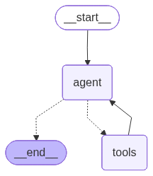
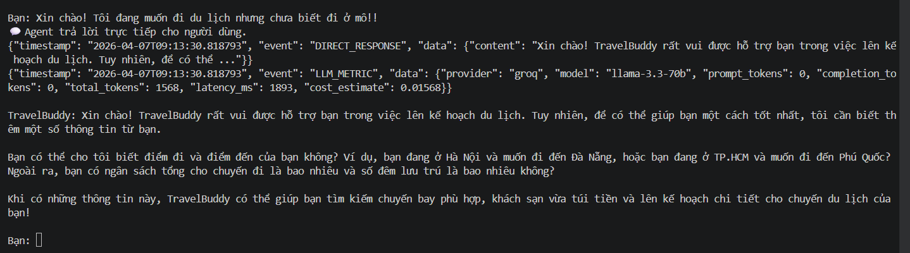
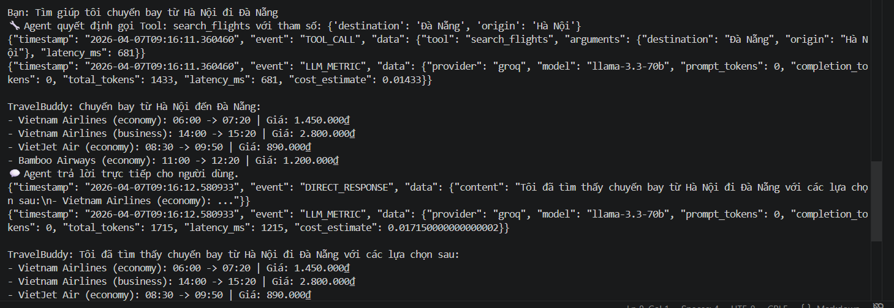
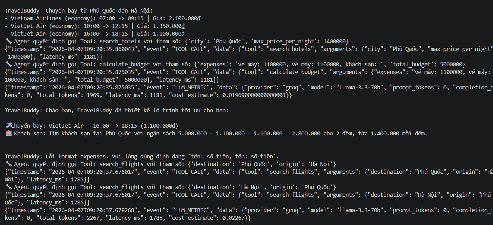
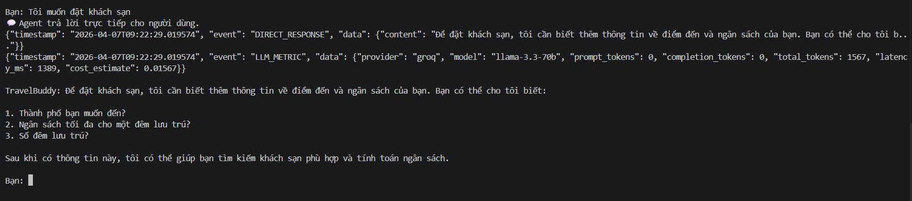
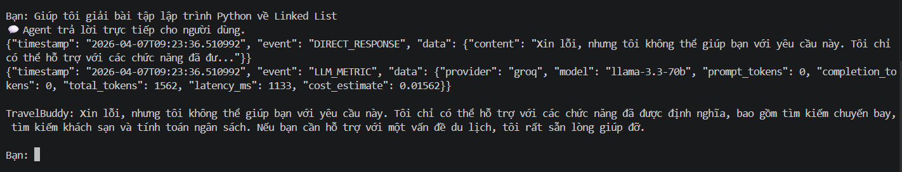

# 📊 Test Results - TravelBuddy Agent

---
## Agent graph

## ✅ Q1 - Direct Response Test
### "Xin chào! Tôi muốn đi du lịch nhưng chưa biết đi đâu"
### Screenshot


### Events Logged

#### 💬 Agent Response (Direct)
```json
{
  "timestamp": "2026-04-07T09:13:30.818793",
  "event": "DIRECT_RESPONSE",
  "data": {
    "content": "Xin chào! TravelBuddy rất vui được hỗ trợ bạn trong việc lên kế hoạch du lịch. Tuy nhiên, để có thể ..."
  }
}
```

#### 📈 LLM Metrics
```json
{
  "timestamp": "2026-04-07T09:13:30.818793",
  "event": "LLM_METRIC",
  "data": {
    "provider": "groq",
    "model": "llama-3.3-70b",
    "prompt_tokens": 0,
    "completion_tokens": 0,
    "total_tokens": 1568,
    "latency_ms": 1893,
    "cost_estimate": 0.01568
  }
}
```

---

## ✅ Q2 - Flight Search Test
### "Tìm giúp tôi chuyến bay từ Hà Nội đi Đà Nẵng"
### Screenshot


### Events Logged

#### 🔧 Tool Call - search_flights
```
Parameters: {'destination': 'Đà Nẵng', 'origin': 'Hà Nội'}
```

```json
{
  "timestamp": "2026-04-07T09:16:11.360460",
  "event": "TOOL_CALL",
  "data": {
    "tool": "search_flights",
    "arguments": {
      "destination": "Đà Nẵng",
      "origin": "Hà Nội"
    },
    "latency_ms": 681
  }
}
```

#### 📈 LLM Metrics (Tool Call)
```json
{
  "timestamp": "2026-04-07T09:16:11.360460",
  "event": "LLM_METRIC",
  "data": {
    "provider": "groq",
    "model": "llama-3.3-70b",
    "prompt_tokens": 0,
    "completion_tokens": 0,
    "total_tokens": 1433,
    "latency_ms": 681,
    "cost_estimate": 0.01433
  }
}
```

#### 💬 Agent Response
```json
{
  "timestamp": "2026-04-07T09:16:12.580933",
  "event": "DIRECT_RESPONSE",
  "data": {
    "content": "Tôi đã tìm thấy chuyến bay từ Hà Nội đi Đà Nẵng với các lựa chọn sau:\n- Vietnam Airlines (economy): ..."
  }
}
```

#### 📈 LLM Metrics (Response)
```json
{
  "timestamp": "2026-04-07T09:16:12.580933",
  "event": "LLM_METRIC",
  "data": {
    "provider": "groq",
    "model": "llama-3.3-70b",
    "prompt_tokens": 0,
    "completion_tokens": 0,
    "total_tokens": 1715,
    "latency_ms": 1215,
    "cost_estimate": 0.017150000000000002
  }
}
```

---

## ✅ Q3 - Multi-Tool Orchestration Test
### "Tôi ở Hà Nội, muốn đi Phú Quốc 2 đêm, budget 5 triệu. Tư vấn giúp"
### Screenshot

### Events Logged

#### 🔧 Tool Call 1 - search_flights
```
Parameters: {'destination': 'Hà Nội', 'origin': 'Phú Quốc'}
```

```json
{
  "timestamp": "2026-04-07T09:20:37.676017",
  "event": "TOOL_CALL",
  "data": {
    "tool": "search_flights",
    "arguments": {
      "destination": "Hà Nội",
      "origin": "Phú Quốc"
    },
    "latency_ms": 1785
  }
}
```

#### 📈 LLM Metrics (search_flights)
```json
{
  "timestamp": "2026-04-07T09:20:37.678268",
  "event": "LLM_METRIC",
  "data": {
    "provider": "groq",
    "model": "llama-3.3-70b",
    "prompt_tokens": 0,
    "completion_tokens": 0,
    "total_tokens": 2267,
    "latency_ms": 1785,
    "cost_estimate": 0.02267
  }
}
```

#### 🔧 Tool Call 2 - search_hotels
```
Parameters: {'city': 'Phú Quốc', 'max_price_per_night': 1400000}
```

```json
{
  "timestamp": "2026-04-07T09:20:38.214110",
  "event": "TOOL_CALL",
  "data": {
    "tool": "search_hotels",
    "arguments": {
      "city": "Phú Quốc",
      "max_price_per_night": 1400000
    },
    "latency_ms": 534
  }
}
```

#### 🔧 Tool Call 3 - calculate_budget
```
Parameters: {'expenses': 'chuyến bay đi: 1100000, chuyến bay về: 1100000', 'total_budget': 5000000}
```

```json
{
  "timestamp": "2026-04-07T09:20:38.214110",
  "event": "TOOL_CALL",
  "data": {
    "tool": "calculate_budget",
    "arguments": {
      "expenses": "chuyến bay đi: 1100000, chuyến bay về: 1100000",
      "total_budget": 5000000
    },
    "latency_ms": 534
  }
}
```

#### 📈 LLM Metrics (Multi-Tool Resolution)
```json
{
  "timestamp": "2026-04-07T09:20:38.214110",
  "event": "LLM_METRIC",
  "data": {
    "provider": "groq",
    "model": "llama-3.3-70b",
    "prompt_tokens": 0,
    "completion_tokens": 0,
    "total_tokens": 2208,
    "latency_ms": 534,
    "cost_estimate": 0.022080000000000002
  }
}
```

#### 💬 Agent Response
```json
{
  "timestamp": "2026-04-07T09:20:39.551926",
  "event": "DIRECT_RESPONSE",
  "data": {
    "content": "Chào bạn, TravelBuddy đã thiết kế lộ trình tối ưu cho bạn:\n\n✈️ Chuyến bay: VietJet Air (economy) - 1..."
  }
}
```

#### 📈 LLM Metrics (Response)
```json
{
  "timestamp": "2026-04-07T09:20:39.552987",
  "event": "LLM_METRIC",
  "data": {
    "provider": "groq",
    "model": "llama-3.3-70b",
    "prompt_tokens": 0,
    "completion_tokens": 0,
    "total_tokens": 2612,
    "latency_ms": 1332,
    "cost_estimate": 0.02612
  }
}
```

---

## ⏳ Q4 - Test Pending
### "Tôi muốn đặt khách sạn"
### Screenshot


### Status
*Awaiting test execution*

---

## ⏳ Q5 - Test Pending
### "Giải giúp tôi bài tập lập trình Python về Linked List"
### Screenshot


### Status
*Awaiting test execution*

---

**Last Updated:** 2026-04-07